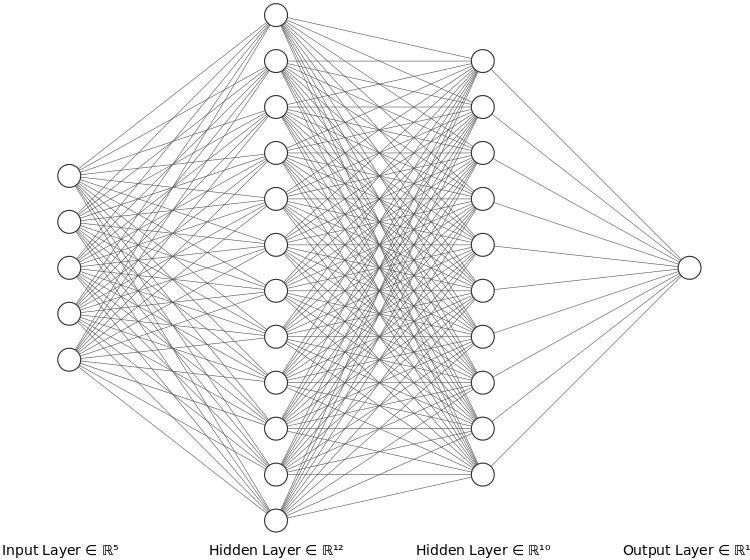
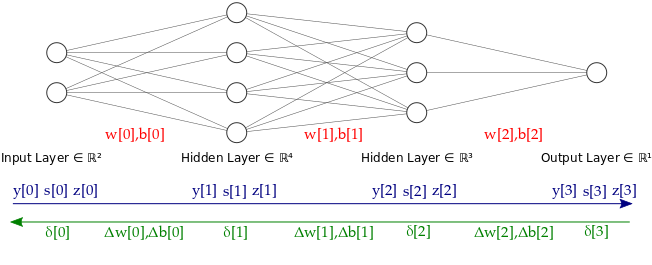

# ANN - Artificial Neural Networks

Ce cours donne un aperçu biologique et historique des réseaux neuronaux artificiels
et présente les fondements théoriques de la rétropropagation et de la
descente de gradient, à l'aide d'un exemple dans numpy.

# 1st notebook : Articial neural networks.ipynb

## A - Introduction to ANN

**A little vocabulary:**

- A neural network is a computation graph.
- The input layer is composed of all input neurons.
- A layer is a (maximum) set of unconnected neurons, at the same depth from the input layer.
- The output layer is composed of all output neurons.
- All layers between the input and output layers are called hidden layers.
- A neural network organized in layers is called a feedforward NN.
- Some neural networks are not feedforward NNs and present loops. They are called Recurrent NN.
- A multilayer NN is often called a multilayer perceptron (for historical reasons)
- The scalar output of a neuron is also called its activation (depending on sources, sometimes it is rather the scalar input that is called activation).
- The vector of outputs for all neurons in a given layer is called the layer's activation.

Neural Network :

</img>

**Activation functions**

- step
   $$\sigma(x) = 0 \textrm{ if }x\leq0\textrm{, }1\textrm{ otherwise}$$
- linear
   $$\sigma(x) = x$$
- sigmoid or logistic (which we will consider by default for now)
   $$\sigma(x) = \frac{1}{1 + e^{-x}}$$
- hyperbolic tangent
   $$\sigma(x) = \frac{e^{x} + e^{-x}}{e^{x} - e^{-x}}$$
- radial basis function (useful in some specific cases like Kohonen maps)
   $$\sigma(x) = e^{-x^2}$$

## B - Learning the weights of a neural network (regression case)

### B.1 - Risk minimization and loss functions

After all, a neural network with a fixed graph structure is a parametric function $f_\theta$ where $\theta$ is the vector of all parameters (all weights and biases).
Learning a neural network that correctly predicts $y$ corresponds to finding the parameters $\theta$ that minimize the following function.
$$L(\theta) = \displaystyle \mathbb{E}_{(x,y)\sim p(x,y)} \left[ \left(f_\theta(x) - y\right)^2 \right] = \int_{x,y} \left[ \left(f_\theta(x) - y\right)^2 \right] \mathrm{d}p(x,y) $$

The smaller $L(\theta)$, the happier we are.

Then, for a given prediction function $f$, one can define the expected value of the loss for the distribution $p(x,y)$: we shall call it the __expected loss__ or the __risk__ $L(f) = \mathbb{E}_{(x,y)\sim p(x,y)} \left[ \ell(f(x),y) \right]$. For a parametrized function $f_\theta$, we directly define $L(\theta)$. Overall, a good predictor is one which __minimizes the risk__.

The training set defines the empirical measure $\bar{p}(x,y)$ and we can approximate the risk by the __empirical risk__:
$$\bar{L}(f) = \mathbb{E}_{(x,y)\sim \bar{p}(x,y)} \left[ \ell(f(x),y) \right] = \frac{1}{N} \sum_{i=1}^N \ell(f(x_i),y_i).$$

### B.2 Stochastic gradient descent

Let's say we have an initial guess $\theta_0$ for the parameters of $f_\theta$. How can we change this guess so that we minimize $L(\theta)$? Plain gradient descent tells us we should move in the opposite direction of the gradient of $L(\theta)$ with respect to $\theta$. So let's write this gradient:

\begin{align*}
\displaystyle \nabla_\theta L(\theta) &= \nabla_\theta \left[ \mathbb{E}_{(x,y)\sim p(x,y)} \left[ \left(f_\theta(x) - y\right)^2 \right] \right]\\
&= \mathbb{E}_{(x,y)\sim p(x,y)} \left[ \nabla_\theta \left[ \left(f_\theta(x) - y\right)^2 \right] \right]\\
&= \mathbb{E}_{(x,y)\sim p(x,y)} \left[ 2 \left(f_\theta(x) - y\right) \nabla_\theta f_\theta(x) \right]
\end{align*}

So, the gradient of $L(\theta)$ is the expectation of $2 \left(f_\theta(x) - y\right) \nabla_\theta f_\theta(x)$. In other words:

$$\nabla_\theta L(\theta) = \int_{x,y} 2 \left(f_\theta(x) - y\right) \nabla_\theta f_\theta(x) \mathrm{d}p(x,y)$$

The theory of _stochastic gradient descent_ tells us that if $g(\theta)$ is a noisy estimator of $\nabla_\theta L(\theta)$, then the following sequence $\theta_k$ converges to a local minimum of $L(\theta)$:
$$\theta_{k+1} = \theta_k - \alpha_k g(\theta_k)$$

Here we have
$$g(\theta) = \frac{1}{N} \sum_{i=1}^N 2 \left(f_\theta(x_i) - y_i\right) \nabla_\theta f_\theta(x_i).$$

### B.3 Recursive gradient computation

In short:
$$\boxed{\delta_j = \left\{\begin{array}{ll}
\sigma'(y_j) & \textrm{for output neurons,}\\
\sigma'(y_j)\sum_{l\in L_j} \delta_l w_{jl} & \textrm{for other neurons.}
\end{array}\right.}$$

### B.4 Backpropagation algorithm

**Forward pass:**

Input $x$  
$\lambda=1$  
While $\lambda\neq$ output layer index:

- Compute $y_\lambda = w_{\lambda-1}^T x$, \
- Compute $z_\lambda = \sigma (y_\lambda)$ and $s_\lambda = \sigma'(y_\lambda)$ \
- $\lambda \leftarrow \lambda+1$ \
- $x \leftarrow z_\lambda$

Output $f_\theta(x)$

**Backpropagation:**

Output difference $\Delta = f_\theta(x) - y$  
$\lambda=$ output layer index  
$\delta_\lambda = s_\lambda$  
$w_{\lambda-1} \leftarrow w_{\lambda-1} - \alpha \Delta (\delta_\lambda \cdot z_{\lambda-1}^T)$  
$\lambda\leftarrow \lambda -1$
While $\lambda \neq 0$:

- $\delta_\lambda = s_\lambda \circ (\delta_{\lambda+1}\cdot w_\lambda)$ \
- $w_{\lambda-1} \leftarrow w_{\lambda-1} - \alpha \Delta (\delta_\lambda \cdot z_{\lambda-1}^T)$ \
- $\lambda\leftarrow \lambda -1$

**In practice :**  to help fix ideas, the picture below summarizes all the data structures used.

</img>

- in red, the network's data: w[i] and b[i] store the weights and biases,
- in blue, what is computed during the forward pass, y[i] for $w^Tx$, s[i] for $\sigma'(x)$, z[i] for neuron activations,
- in green, what is computed during the backward pass, $\delta$[i] and the weights and biases updates.

## C - Premier MultiLayer Perceptron MLP

<div style="background-color: #282828; padding: 15px; border: 1px solid #faebcc; border-radius: 5px;">

```python
X = np.linspace(0,1,1000)
Y = observation(X)

from sklearn.neural_network import MLPRegressor

myNN = MLPRegressor(hidden_layer_sizes=(100,10), activation='tanh', solver='lbfgs', max_iter=5000, learning_rate_init=0.1) 
myNN.fit(X,Y)
ypredict = myNN.predict(X)

Scikit-learn for Classification : Scikit-learn offers an easy API for classification as illustrated below, but its flexibility remains limited and PyTorch offers a great API that we shall use in the next part of this class.

# 2nd notebook : Visualizing Backpropagation.ipynb

<div style="background-color: #282828; padding: 15px; border: 1px solid #faebcc; border-radius: 5px;">

```python
import numpy as np


class ANN:
    """Multi-layered neural network (fully connected) for regression with
    activation functions
    """

    def __init__(self, sizes):
        self.layer_sizes = sizes
        self.biases = [np.random.randn(1, y) for y in self.layer_sizes[1:]]
        self.weights = [np.random.randn(out, inp) for inp, out in
                        zip(self.layer_sizes[:-1], self.layer_sizes[1:])]

    def __call__(self, x):
        return self.forward_pass(x)

    def reset_weights(self):
        self.biases = [np.random.randn(1, y) for y in self.layer_sizes[1:]]
        self.weights = [np.random.randn(out, inp) for inp, out in
                        zip(self.layer_sizes[:-1], self.layer_sizes[1:])]

    def sigmoid(self, z):
        """The sigmoid function.

        Parameters
        ----------
        z : np.array
            Input array of N scalar values. Should be a Nx1 array

        Returns
        -------
        np.array :
            The value of the sigmoid function in each of the N input scalars.
            Array of size Nx1.
        np.array :
            The derivative of the sigmoid function in each of the N input
            scalars. Array of size Nx1.
        """
        val = 1.0/(1.0+np.exp(-z))
        der = val*(1.-val)
        return val, der

    def forward_pass(self, x, verbose=False):
        """Forward propagation of x through the network.

        Parameters
        ----------
        x : np.array
            The input minibatch with N elements of dimension p. Should be a Nxp
            array.
        verbose : boolean, optional
            Indicates whether to print intermediate layer inputs and
            activations.

        Returns
        -------
        list :
            A list of layer-wise input arrays of shape N x layer_size
        list :
            A list of layer-wise activation derivative arrays of shape N x
            layer_size
        list :
            A list of layer-wise activation arrays of shape N x layer_size
        """
        z = [np.zeros((x.shape[0], sz)) for sz in self.layer_sizes]
        s = [np.zeros((x.shape[0], sz)) for sz in self.layer_sizes]
        y = [np.zeros((x.shape[0], sz)) for sz in self.layer_sizes]
        z[0] = x.copy()
        for i in range(1, len(self.layer_sizes)):
            if verbose:
                print("# Forward propagation to layer", i)
            y[i] = np.dot(z[i-1], self.weights[i-1].T) + self.biases[i-1]
            if verbose:
                print("Neuron inputs:", y[i])
            if i == len(self.layer_sizes)-1:
                s[i] = np.ones((x.shape[0], self.layer_sizes[-1]))
                z[i] = y[i]
            else:
                v, d = self.sigmoid(y[i])
                s[i] = d
                z[i] = v
            if verbose:
                print("Layer outputs:", z[i])
        return y, s, z

    def backward_pass(self, out, y, s, z, alpha):
        """Gradient step on the network weights

        Parameters
        ----------
        out : np.array
            The target minibatch with N elements. Should be a Nx1 array.
        y : np.array
            The inputs to each layer computed during the forward pass on the
            input minibatch with N elements. Should be a list of N x layer_size
            arrays.
        z : np.array
            The activations of each layer computed during the forward pass on
            the input minibatch with N elements. Should be a list of N x
            layer_size arrays.
        s : np.array
            The derivatives of each layer's activation computed during the
            forward pass on the input minibatch with N elements. Should be a
            list of N x layer_size arrays.
        alpha : float
            The learning rate.
        """
        delta = [np.zeros((out.shape[0], sz)) for sz in self.layer_sizes]
        error = z[-1] - out
        for i in range(len(self.layer_sizes)-1, 0, -1):
            # compute delta
            if i == len(self.layer_sizes)-1:
                delta[i] = s[-1]
            else:
                delta[i] = np.dot(delta[i+1], self.weights[i])
                delta[i] = np.multiply(delta[i], s[i])
            # intermediate delta value that includes the error term (useful for
            # minibatches since each element has a different error value)
            delta_temp = np.multiply(delta[i], error)
            # update weights
            grad_w = np.dot(delta_temp.T, z[i-1])
            grad_b = np.sum(delta_temp, axis=0)
            self.weights[i-1] -= alpha * grad_w
            self.biases[i-1] -= alpha * grad_b
        return delta

    def train_on_minibatch(self, training_x, training_y, alpha):
        """Performs a forward and a backward pass on the input minibatch

        Parameters
        ----------
        training_x : np.array
            The input minibatch with N elements of dimension p. Should be a Nxp
            array.
        training_y : np.array
            The target minibatch with N elements. Should be a Nx1 array.
        alpha : float
            The learning rate.
        """
        y, s, z = self.forward_pass(training_x)
        self.backward_pass(training_y, y, s, z, alpha)
        return