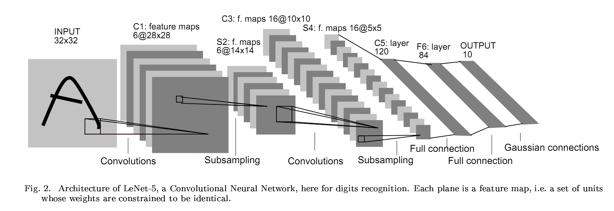
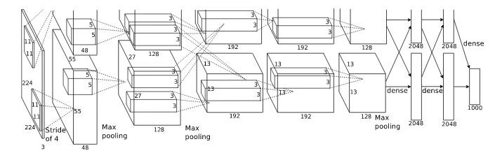
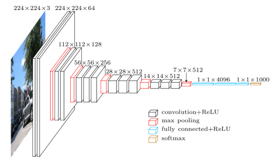
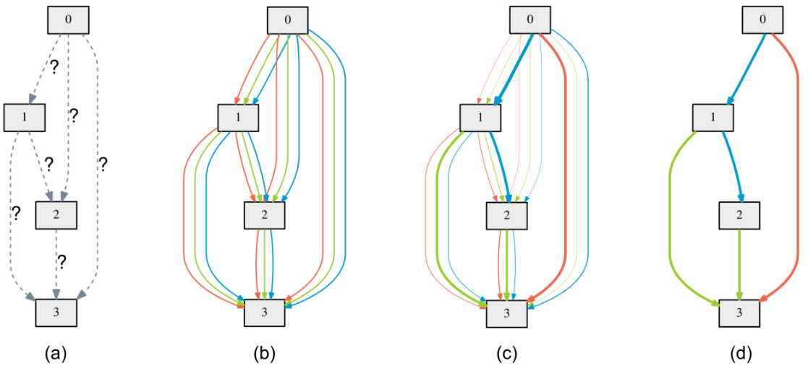

# Deep Learning : introduction

Utilisation des bibliothèques pytorch, pytorchvision, ignite

- **Fashion-MNIST**

[Fashion-MNIST](https://github.com/zalandoresearch/fashion-mnist) est un ensemble de données composé d'images d'articles Zalando, comprenant un ensemble d'apprentissage de 60 000 exemples et un ensemble de test de 10 000 exemples. Chaque exemple est une image en niveaux de gris de 28 x 28 pixels, associée à une étiquette parmi 10 classes. Fashion-MNIST remplace directement l'ensemble de données MNIST original pour l'évaluation des algorithmes d'apprentissage automatique. Il partage la même taille d'image et la même structure de répartition entre entraînement et test, mais est plus complexe.

# 1st notebook : Implémentation d'un premier CNN

## A - ANN in Layers

### A.1 - Couche linéaire : **torch.nn.Linear**

`class Linear(torch.nn.modules.module.Module) :`  
`Linear(in_features: int, out_features: int, bias: bool = True, device=None, dtype=None) -> None`

Applique une transformation linéaire affine aux données entrantes : $y = xA^T + b$.

Args:

- in_features: taille de chaque échantillon d'entrée
- out_features : taille de chaque échantillon de sortie
- bias : si défini sur « False », la couche n'apprendra pas de biais additif. Default: `True`

**Fonction forward :**

```python
from torch import nn

fc = nn.Linear(784, 10)

def forward(x):
    x = x.view(-1, 28 * 28) # Transforms from (1, 28, 28) to (1, 784)
    x = fc(x) # Goes through fully connected layer
    return x # Output, 10 neurons
```

### A.2 - 1st NN

Nous formaliserons nos fonctions de réseau neuronal dans une classe `torch.nn.Module` qui crée les couches lors de l'initialisation, puis calcule le passage avant du réseau avec la fonction `forward(x)`.

```python
class SimpleNet(nn.Module):
    def __init__(self):
        super(SimpleNet, self).__init__()
        self.fc1 = nn.Linear(784, 120)
        self.fc2 = nn.Linear(120, 10)

    def forward(self, x):
        x = x.view(-1, 784)
        x = self.fc1(x)
        x = self.fc2(x)
        return x
net = SimpleNet()
```

## B - Backpropagation & Training

- **Backpropagation sous PyTorch :**

La définition du gradient dans `y` dépend du calcul de `x` et nous permet de calculer `dy/dx` en appelant `backward()`. Ce processus est appelé « différenciation automatique » (backward differentiation), car les gradients à chaque étape du calcul sont calculés automatiquement.

La différenciation automatique s'applique sur la loss ici.

- **Training :**

Torch fournit des fonctions de perte et des optimiseurs que nous pouvons utiliser au lieu de les écrire, par ex :

```python
torch.nn.CrossEntropyLoss
torch.optim.SGD

criterion = nn.CrossEntropyLoss()
optimizer = torch.optim.SGD(net.parameters(), lr=0.001, momentum=0.9)
```

Boucle de training :

```python
trainloader = torch.utils.data.DataLoader(trainset, batch_size=512, shuffle=True, num_workers=2)
for i, data in enumerate(trainloader, 0):
        # get the inputs; data is a list of [inputs, labels]
        inputs, labels = data
        # zero the parameter gradients
        optimizer.zero_grad()
        # forward + backward + optimize
        outputs = net(inputs)
        loss = criterion(outputs, labels)
        loss.backward()
        optimizer.step()
        train_loss += loss.item()
```

Bonus : trainloader et testloader depuis FashionMNIST

```python
train_loader = torch.utils.data.DataLoader(
    datasets.FashionMNIST(
        "../data",
        train=True,
        download=True,
        transform=transforms.Compose(
            [transforms.ToTensor(), transforms.Normalize((0.1307,), (0.3081,))]
        ),
    ),
    batch_size=64,
    shuffle=True,
)

test_loader = torch.utils.data.DataLoader(
    datasets.FashionMNIST(
        "../data",
        train=False,
        transform=transforms.Compose(
            [transforms.ToTensor(), transforms.Normalize((0.1307,), (0.3081,))]
        ),
    ),
    batch_size=1000,
    shuffle=True,
)
```

## C - Avec une fonction d'activation

Jusqu'à présent, notre réseau est une chaîne de $$ Y = w^T x+b $$ Cependant, lors du dernier cours, les neurones que nous avons modélisés utilisaient des fonctions sigmoïdes : $$ Y = \sigma(w^T x+b) $$ Appliquons cela à notre réseau actuel et voyons comment cela modifie l'entraînement. Torch propose deux façons de procéder : définir une couche `torch.nn.Sigmoid` ou appliquer la fonction `torch.sigmoid`. Nous utiliserons la méthode fonctionnelle.

Nouveau type de fonction d'activation : **Rectified Linear Units (ReLU).**
$$\sigma(y) = \max\{0,y\}$$

La propriété clé de cette fonction est que sa dérivée est soit zéro, soit un.

Bien qu'elles nous permettent d'entraîner des réseaux profonds, les fonctions ReLU présentent des inconvénients.

- Unbounded values : la sortie d'une couche n'est plus limitée, ce qui peut entraîner une divergence.
- Dying ReLU neurons : la backpropagation des gradients peut pousser les poids d'entrée vers des valeurs telles que $\sigma(y)=0$ en permanence. Ensuite, toutes les rétropropagations futures laisseront ces poids inchangés : le neurone est mort.

Dans torch, la fonction d'activation ReLU est soit une couche `torch.nn.ReLU`, soit une fonction dans `torch.nn.functional.relu`.

```python
import torch.nn.functional as F

class ReLUNet(nn.Module):
    def __init__(self):
        super(ReLUNet, self).__init__()
        self.fc1 = nn.Linear(784, 120)
        self.fc2 = nn.Linear(120, 10)

    def forward(self, x):
        x = x.view(-1, 784)
        x = F.relu(self.fc1(x))
        x = self.fc2(x)
        return x

net = ReLUNet()
train(net)
y_valid, predictions = get_valid_predictions(net)
print('Accuracy: ', accuracy_score(predictions, y_valid))
```

Exemple d'un CNN avec les fonctions de couches `torch.nn.Conv2d` et `torch.nn.MaxPool2d` :

- Couche d'entrée : images de taille $28\times 28$ avec un seul canal
- Couche convolutive de 32 cartes de caractéristiques avec des filtres $3\times 3$
- Couche de MaxPooling par blocs de taille $2 \times 2$
- Couche convolutive de 64 cartes de caractéristiques avec des filtres $3\times 3$
- Couche de MaxPooling par blocs de taille $2 \times 2$
- Couche entièrement connectée avec 128 neurones ReLU
- Couche de sortie entièrement connectée avec 10 neurones ReLU

Le output_size se calcule en prenant en compte l'évolution de la taille de x de couche en couche :

(32,28,28) -> (32,26,26) -> (32,13,13) -> (64,11,11) -> (64,5,5)

Et ainsi output_size = 1600 = 64 * 5 * 5

```python
output_size = 1600
class ConvNet(nn.Module):
    def __init__(self):
        super(ConvNet, self).__init__()
        self.conv1 = nn.Conv2d(1, 32, 3)
        self.conv2 = nn.Conv2d(32, 64, 3)
        self.fc1 = nn.Linear(output_size, 128)
        self.fc2 = nn.Linear(128, 10)

    def forward(self, x):
        x = self.conv1(x)
        x = F.max_pool2d(x, 2)
        x = self.conv2(x)
        x = F.max_pool2d(x, 2)
        #print(x.shape)
        x = torch.flatten(x, 1)
        x = self.fc1(x)
        x = F.relu(x)
        x = self.fc2(x)
        output = F.relu(x)
        return output

net = ConvNet()
train(net)
y_valid, predictions = get_valid_predictions(net)
print('Accuracy: ', accuracy_score(predictions, y_valid))
```

Lorsqu'on epoch, on peut finir sur de l'overfitting, 2 techniques pour éviter cela :

- Early Stopping : arrêter l'entraînement prématurément en fonction de l'augmentation de la validation loss
- Dropout : ne pas entraîner certains poids à une étape de mise à jour donnée. Les activations des neurones sont « abandonnées » (mises à zéro) avec une probabilité *p*.

## D - Types de CNN

- **LeNet** est souvent considéré comme le premier réseau neuronal convolutif profond moderne.



- **AlexNet** s'est fait connaître grâce à ses performances dans la classification ImageNet.



- **VGG**



Autres :

- InceptionNet
- GoogLeNet
- ResNet

Autre outil : Differentiable Architecture Search



La recherche d'architecture neuronale (Neural Architecture Search), c'est-à-dire la recherche automatique d'architectures, est un domaine de recherche en pleine expansion. Des réseaux plus performants que ResNet ou VGG ont été découverts grâce à cette méthode pour les benchmarks CIFAR et ImageNet.

---

# 2e notebook : PyTorch Ignite

## Convolutional Neural Networks for Classifying Fashion-MNIST Dataset using Ignite

Ignite is a high-level library to help with training and evaluating neural networks in PyTorch flexibly and transparently.

Why Ignite ? Ignite is a library that provides three high-level features:

- Extremely simple engine and event system
- Out-of-the-box metrics to easily evaluate models
- Built-in handlers to compose training pipeline, save artifacts and log parameters and metrics

No more coding for/while loops on epochs and iterations. Users instantiate engines and run them.

Voir le notebook *deep/PyTorch Ignite.ipynb* pour apprendre à implémenter avec Ignite.