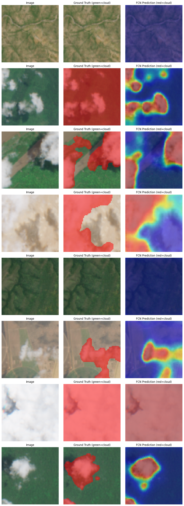
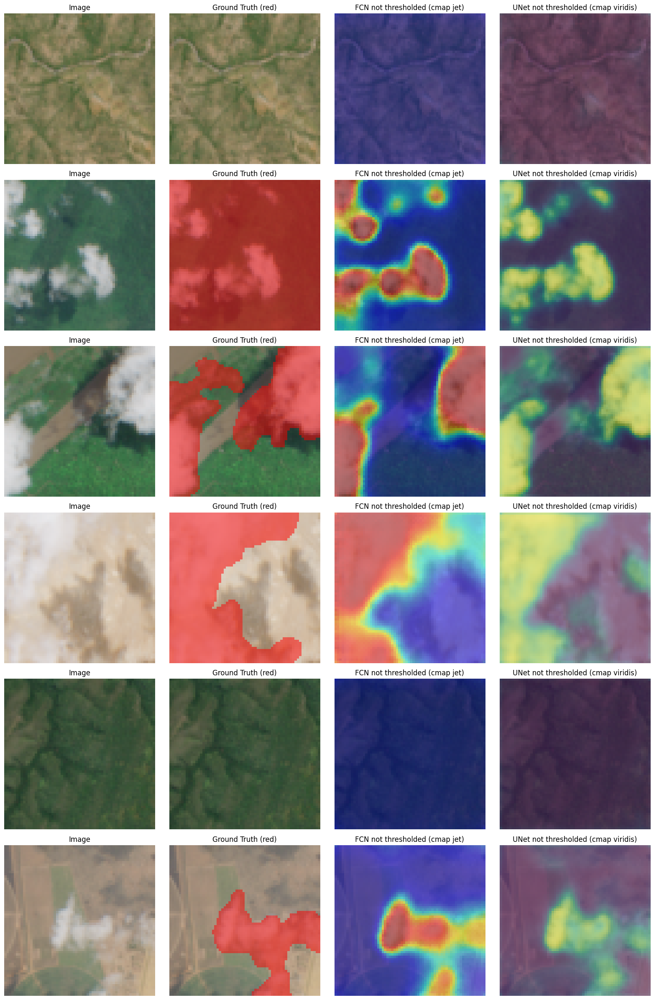
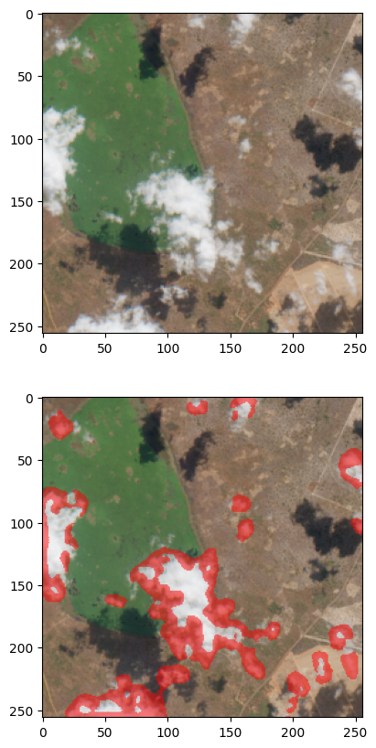
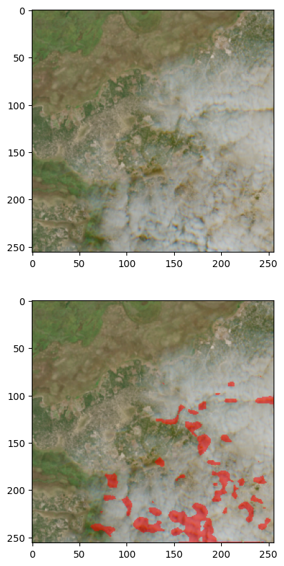
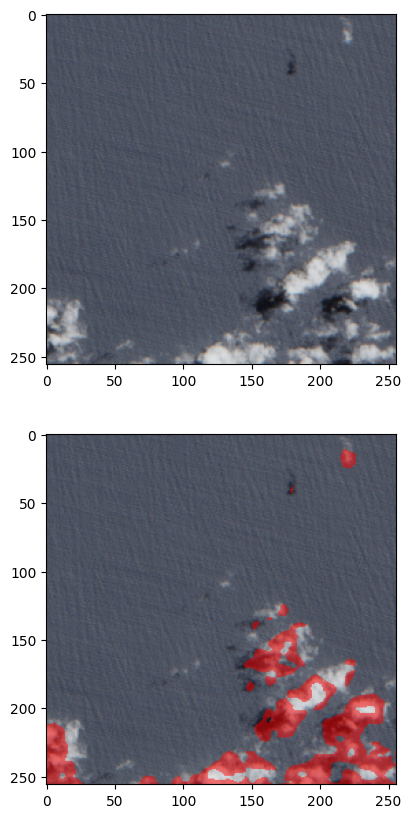

# Introduction to Convolutional Neural Networks

# -1 - Théorie

Cours associé : https://fchouteau.github.io/isae-intro-to-cnns

### Notions abordées

1. **Architectures des CNN avec :**

   - Création de CNN avec nn.Sequential, les différents layers :

      - Convolution avec nn.Conv2d
      - Pooling avec nn.MaxPool2d : c'est un compresseur, il sert à simplifier l'information ;
      - Fully Connected avec nn.Linear : combiner toutes les caractéristiques extraites précédemment pour prendre une décision finale ;
      - Applatissement de tenseur avec nn.Flatten : convertir le volume de données 3D (canaux x hauteur x largeur) en un long vecteur plat ;
      - Normalisation avec nn.BatchNorm2d : rôle de stabiliser et d'accélérer l'entraînement en forçant les sorties d'une couche de convolution à avoir une moyenne de 0 et une variance de 1 ;
      - Fonction d'activation :
         - Sigmoid avec nn.Sigmoid
         - Rectified Linear Units (ReLU) avec nn.ReLU : introduire de la non-linéarité pour permettre au réseau d'apprendre des relations complexes

   - Optimisation :

      - Dropout avec nn.Dropout
      - optimiser avec optim.SGD

2. **Des méthodes/outils :**

   - **Transfert Learning :** les connaissances acquises avec une tâche ou un jeu de données sont utilisées pour améliorer les performances du modèle sur une tâche associée et/ou un autre jeu de données. Ex : un modèle entraîné à reconnaître un chien transféré sur un dataset avec des chiens et des chats, qui apprend alors à différencier chien et chat.

      - Feature Extraction : tu figes les couches du modèle pré-entraîné afin de préserver l'apprentissage existant et ajoutes de nouvelles couches pour apprendre des informations supplémentaires.
      - Fine-tuning (Réglage fin) : tu dégèles le modèle entier et l'entraînes avec un learning rate plus faible pour l'adapter aux nouveaux défis.

   - Binary classification metrics :

      - Matrice de confusion avec TP, FP, FN, TN (True Positive, False Positive, False Negative, True Negative)
      - Precision = $\frac{TP}{TP + FP}$ et Recall = $\frac{TP}{TP + FN}$
      - Courbe ROC (ratio TP / FP)
      - Courbe PR (ratio Precision / Recall)

   - PyTorch Ignite

3. **Les modèles préexistants :**

   - resnet18 : CNN de 18 couches, on peut charger une version entraînée sur plus d'un millions d'images dans la base de données ImageNet ; `import torchvision.models \ model = torchvision.models.resnet18(num_classes = 2)`
   - timm : Py**T**orch **Im**age **M**odels (timm) est une collection de modèles d'images, de couches, d'utilitaires, d'optimiseurs, de planificateurs, de chargeurs/augmentations de données et de scripts de référence pour l'entraînement/la validation qui vise à rassembler une grande variété de modèles SOTA capables de reproduire les résultats d'entraînement d'ImageNet.

      - les modèles sont trouvables ici : https://huggingface.co/models?library=timm&sort=trending
      - le github associé : https://github.com/huggingface/pytorch-image-models
      - la documentation : https://huggingface.co/docs/timm/index

4. **Les Extensions modernes de CNN :**

   - **Vision Transformers (ViT)** : biais inductif moindre que les CNN, nécessite plus de données mais est plus flexible
   - **Réseaux neuronaux graphiques** : biais inductif pour les données structurées en graphes
   - **Transformateurs** : hypothèses minimales, ordre des séquences appris à partir des intégrations de position

# 0 - Deep Learning pour la vision par ordinateur

## A - Intro

### 0.A.1 - Filtres

- Identity (ne fait rien) : 
- Flou avec moyenne (normalisé) : 
- Flou gaussien : 
- Edge detection :  ou 
- Sharpen (opposé du flou, relève les détails de hautes-fréquences) : 

### 0.A.2 - Bases des CNN

Dans le traitement d'images classique, nous utilisons la convention **(hauteur, largeur, canaux)** (par exemple, 512×512×3), comme matplotlib.  
Cependant, **PyTorch et la plupart des frameworks d'apprentissage profond utilisent (canaux, hauteur, largeur)** (par exemple, 3×512×512).

Pourquoi les CNN fonctionnent-ils ?

Pour obtenir de bons résultats, nous devons intégrer certaines connaissances préalables sur le problème.

    Les hypothèses nous aident lorsqu'elles sont vraies.
    Elles nous nuisent lorsqu'elles ne le sont pas.
    Nous voulons faire juste ce qu'il faut d'hypothèses, pas plus.

En Deep Learning

    Plusieurs couches : compositionnalité.
    Convolutions : localité + stationnarité des images.
    Pooling : invariance de la classe d'objets par rapport aux translations.

## 0.B - Boucles standards sous PyTorch

### 0.B.1 - Understanding the PyTorch Training Loop

The `train()` function implements one epoch of training. Here's the standard deep learning training cycle:

**Training Loop Components:**

1. **`model.train()`**: Règle le modèle sur le mode d'entraînement.

   - Active le dropout (le cas échéant), les mises à jour de normalisation par lots, etc.
   - Important : comportement différent de celui de `model.eval()`

2. **Batch Processing Loop**: Itérer sur les mini-batches à partir de DataLoader

   - `enumerate(train_loader)` nous donne des lots de (data, target)
   - Batch size = 64 images à la fois (memory efficient)

3. **Move to Device**: `data.to(device)`, `target.to(device)`

   - Transfère les tenseurs vers le GPU/MPS/CPU selon la configuration.
   - Essentiel pour l'accélération GPU !

4. **The Optimization Cycle** (répété pour chaque lot) :

   a. __`optimizer.zero_grad()`__ : effacer les gradients précédents.

   - PyTorch accumule les gradients par défaut - il faut les réinitialiser !
   - Si vous oubliez cette étape, les mises à jour seront incorrectes.

   b. **Passage vers l'avant** : `output = model(data)`.

   - Exécutez l'entrée via le réseau.
   - Calculez les prédictions.

   c. __Calcul de la perte__ : `loss = F.nll_loss(output, target)`

   - Loss de log-vraisemblance négative pour la classification
   - Mesure à quel point les prédictions ont tord

   d. **`loss.backward()`** : calcule les gradients via la rétropropagation

   - Différenciation automatique ! La magie de PyTorch
   - Calcule ∂loss/∂weight pour chaque paramètre

   e. **`optimizer.step()`** : met à jour les poids à l'aide des gradients

   - Mise à jour SGD : poids = poids - taux d'apprentissage × gradient
   - Avec momentum : lisse les mises à jour au fil du temps

**Le paramètre « perm »** : utilisé pour l'expérience de permutation des pixels (expliquée plus loin)

- Par défaut : « torch.arange(0, 784) » conserve les pixels dans l'ordre
- Expérience : permutation aléatoire pour tester les hypothèses du CNN

**Conseils pratiques :**

- Vérifiez toujours que la perte diminue pendant l'entraînement.
- Imprimez la progression tous les N lots pour surveiller l'entraînement.
- Si la perte est NaN : taux d'apprentissage trop élevé ou instabilité numérique.

### 0.B.2 - Comprendre la fonction Test/Évaluation

La fonction `test()` évalue les performances du modèle sur des données non vues sans mettre à jour les poids.

**Principales différences par rapport à l'entraînement :**

1. **`model.eval()`** : met le modèle en mode évaluation

   - Désactive le dropout (utilise tous les neurones)
   - Utilise les statistiques en cours pour la normalisation par lots.
   - Aucun calcul de gradient n'est nécessaire (économie de mémoire !).

2. **Aucune mise à jour du gradient** : nous n'avons besoin que des prédictions, pas de rétropropagation.

   - Pas d'`optimizer.zero_grad()`, `loss.backward()` ou `optimizer.step()`.
   - Cela rend l'évaluation beaucoup plus rapide.

3. **Accumuler les métriques** :

   - `test_loss` : somme de toutes les pertes par lot (puis moyenne)
   - `correct` : nombre d'échantillons correctement classés

4. **Loss Agregation** : `reduction="sum"`

   - Additionne les pertes sur tous les échantillons (et non la moyenne par lot)
   - Divise ensuite par le nombre total d'échantillons pour obtenir la perte moyenne

5. **Extraction des prédictions** : `output.data.max(1, keepdim=True)[1]`

   - `max(1, ...)` : recherche la valeur maximale le long de la dimension 1 (dimension de classe)
   - `[1]` : obtient les indices (étiquettes de classe), pas les valeurs
   - Renvoie la classe prédite pour chaque échantillon

6. **Calcul de la précision** :

   - Compare les prédictions avec la vérité terrain : `pred.eq(target)`
   - Additionne les prédictions correctes et divise par le nombre total d'échantillons

**Meilleure pratique :** évaluez toujours sur un ensemble de test réservé afin de détecter tout surajustement !

- La précision de l'entraînement peut être élevée, mais la précision du test faible → surajustement
- Les deux sont faibles → sous-ajustement (besoin de plus de capacité ou d'entraînement)
- Les deux sont élevés → bonne généralisation !

```python
def train(epoch, model, perm=torch.arange(0, 784).long()):
    model.train()
    for batch_idx, (data, target) in enumerate(train_loader):
        # send to device
        data, target = data.to(device), target.to(device)

        # permute pixels
        data = data.view(-1, 28 * 28)
        data = data[:, perm]
        data = data.view(-1, 1, 28, 28)

        optimizer.zero_grad()
        output = model(data)
        loss = F.nll_loss(output, target)
        loss.backward()
        optimizer.step()
        if batch_idx % 100 == 0:
            print(
                "Train Epoch: {} [{}/{} ({:.0f}%)]\tLoss: {:.6f}".format(
                    epoch,
                    batch_idx * len(data),
                    len(train_loader.dataset),
                    100.0 * batch_idx / len(train_loader),
                    loss.item(),
                )
            )


def test(model, perm=torch.arange(0, 784).long()):
    model.eval()
    test_loss = 0
    correct = 0
    for data, target in test_loader:
        # send to device
        data, target = data.to(device), target.to(device)

        # permute pixels
        data = data.view(-1, 28 * 28)
        data = data[:, perm]
        data = data.view(-1, 1, 28, 28)
        output = model(data)
        test_loss += F.nll_loss(
            output, target, reduction="sum"
        ).item()  # sum up batch loss
        pred = output.data.max(1, keepdim=True)[
            1
        ]  # get the index of the max log-probability
        correct += pred.eq(target.data.view_as(pred)).cpu().sum().item()

    test_loss /= len(test_loader.dataset)
    accuracy = 100.0 * correct / len(test_loader.dataset)
    accuracy_list.append(accuracy)
    print(
        "\nTest set: Average loss: {:.4f}, Accuracy: {}/{} ({:.0f}%)\n".format(
            test_loss, correct, len(test_loader.dataset), accuracy
        )
    )
```

## 0.C - FC vs CNN

Fully Connected Layers (FC) :

- Chaque neurone d'une couche est connecté à absolument tous les neurones de la couche précédente. Si vous avez une image de 100×100 pixels, le premier neurone de la couche FC doit gérer 10 000 connexions.
- Chaque connexion a son propre poids unique. Pour une grande image, le nombre de paramètres explose (des millions), ce qui rend l'entraînement lent et gourmand en mémoire.
- Elle est très sensible à la position. Si vous apprenez à reconnaître un chat au centre de l'image, et que dans l'image suivante le chat est en haut à gauche, la couche FC risque de ne pas le reconnaître car les pixels activés sont totalement différents.
- Pas de biai inductif : Flexible, robuste face aux violations d'hypothèses, MAIS nécessite davantage de données/paramètres

ConvNet (CNN) :

- Un neurone n'est connecté qu'à une petite zone locale de l'image (par exemple un carré de 3×3 pixels).
- On utilise le partage de poids. Un filtre (noyau) qui apprend à détecter un "bord horizontal" va utiliser les mêmes poids pour balayer toute l'image. Cela réduit drastiquement le nombre de paramètres.
- Grâce à la convolution qui "glisse" partout, le réseau devient capable de reconnaître un motif peu importe où il se trouve dans l'image.
- Biai inductif fort : Apprentissage rapide, efficace en termes de données, MAIS souffre lorsque les hypothèses ne se vérifient pas.

### Comparaison pour 2 types de data différentes : avec/sans hypothèse (inductive bias)

1. **CNN sur des données normales (niveau le plus élevé)** : précision d'environ 85 à 90 %

   - Les hypothèses correspondent à la réalité → avantage maximal du biais inductif
   - Apprentissage efficace avec peu de paramètres

2. **FC sur des données normales (bonnes)** : précision d'environ 75 à 80 %

   - Aucune hypothèse intégrée, doit apprendre la structure spatiale à partir de zéro
   - Nécessite davantage de données/paramètres pour égaler les performances du CNN

3. **FC sur des données brouillées (idem n° 2)** : précision d'environ 75 à 80 %

   - **Conclusion clé** : performances inchangées !
   - Aucune hypothèse spatiale à enfreindre
   - Traite les pixels comme des caractéristiques indépendantes, quel que soit leur ordre

4. **CNN sur des données brouillées (pire scénario)** : précision d'environ 60 à 70 %

   - **Baisse critique** : le biais inductif nuit désormais !
   - Les convolutions supposent que les pixels proches sont liés (ce qui n'est plus le cas)
   - Le partage des paramètres signifie qu'il ne peut pas apprendre les relations indépendantes entre les pixels

**Le compromis fondamental :**
| Architecture | Hypothèses | Quand c'est bon | Quand c'est mauvais |
|--------------|-------------|-----------|----------|
| **CNN** | A priori spatiaux forts | Données structurées en grille (images, spectrogrammes audio) | Données non structurées, données tabulaires |
| **FC** | Aucune hypothèse | Tout type de données, en particulier lorsque la structure est inconnue | Images/séquences (nécessite davantage de données) |

**Conclusions pratiques :**

1. **Utilisez les CNN pour les images** - le biais inductif est presque toujours utile
2. **N'utilisez pas les CNN pour les données tabulaires** - aucune structure spatiale à exploiter
3. **Le choix de l'architecture encode les hypothèses** - choisissez en fonction de la structure des données
4. **Plus d'hypothèses ≠ toujours mieux** - les hypothèses doivent correspondre à la réalité
5. **Efficacité des données** : des hypothèses correctes réduisent considérablement les besoins en données

**Extensions modernes :**

- **Vision Transformers (ViT)** : biais inductif moindre que les CNN, nécessite plus de données mais est plus flexible
- **Réseaux neuronaux graphiques** : biais inductif pour les données structurées en graphes
- **Transformateurs** : hypothèses minimales, ordre des séquences appris à partir des intégrations de position

Cette expérience démontre parfaitement pourquoi **l'architecture est importante** dans l'apprentissage profond !

---

# 1. Application sur un dataset de satellites

## 1.A - Définition d'un modèle et calcul des paramètres

Nous allons maintenant définir un CNN à entraîner. On l'appelle généralement un « réseau » et nous définissons son « architecture ».

La définition d'une bonne architecture est un vaste domaine de recherche (une boîte de Pandore) qui prend beaucoup de temps, mais nous pouvons facilement définir des « architectures raisonnables » :

Fondamentalement, les architectures CNN sont des empilements de :

- Couches de convolution + non-linéarités
- Couche de pooling
- Une couche « d'activation » finale à la fin (pour la classification) qui nous permet de produire des probabilités


Définissons un modèle :

```python
model = nn.Sequential(
    # A block of 2 convolutions + non linearities & a pooling layers
    # IN SHAPE (3,64,64)
    nn.Conv2d(in_channels=3, out_channels=16, kernel_size=3),
    # OUT SHAPE (16,62,62)
    nn.ReLU(),
    # IN SHAPE (16,62,62)
    nn.Conv2d(in_channels=16, out_channels=16, kernel_size=3),
    # OUT SHAPE (16,60,60)
    nn.ReLU(),
    nn.MaxPool2d(2),
    # OUT SHAPE (16,30,30)
    # Another stack of these
    nn.Conv2d(in_channels=16, out_channels=32, kernel_size=3),
    # OUT SHAPE (?,?,?)
    nn.ReLU(),
    nn.Conv2d(in_channels=32, out_channels=32, kernel_size=3),
    nn.ReLU(),
    nn.Conv2d(in_channels=32, out_channels=32, kernel_size=3),
    nn.ReLU(),
    nn.MaxPool2d(2),
    # OUT SHAPE (?,?,?)
    # Another stack of these
    nn.Conv2d(in_channels=32, out_channels=64, kernel_size=3),
    # OUT SHAPE (?,?,?)
    nn.ReLU(),
    nn.Conv2d(in_channels=64, out_channels=64, kernel_size=3),
    # OUT SHAPE (?,?,?)
    nn.ReLU(),
    nn.MaxPool2d(2),
    # OUT SHAPE (?,?,?)
    # A final classifier
    nn.Flatten(),
    nn.Linear(in_features=4 * 4 * 64, out_features=256), # do you understand why 4 * 4 * 64 ?
    nn.ReLU(),
    nn.Dropout(p=0.25),
    nn.Linear(in_features=256, out_features=64),
    nn.ReLU(),
    nn.Dropout(p=0.25),
    nn.Linear(in_features=64, out_features=1),
    nn.Sigmoid(),
)

```

## 1.B - Entraînement du modèle

### Training/Validation

On fait une boucle sur plein d'epoch du duo train/validation.

Le modèle est initialisé au début.

On l'entraîne, on le valide, et on recommence pour chaque epoch.

A chaque nouvel entraînement, le modèle ne repart pas de zéro. Il continue l'apprentissage précédent.

```python
# Init the training
model, criterion, optimizer = setup_training()

# Send model to GPU
model = model.to(DEVICE)

train_losses = []
valid_losses = []

# loop over the dataset multiple times
for epoch in range(EPOCHS):
    model.train()
    train_epoch_loss = train_one_epoch(model, train_loader)
    model.eval()
    valid_epoch_loss = valid_one_epoch(model, val_loader)

    print(f"EPOCH={epoch}, TRAIN={train_epoch_loss:.05f}, VAL={valid_epoch_loss:.05f}")

    train_losses.append(train_epoch_loss)
    valid_losses.append(valid_epoch_loss)

# Plot training / validation loss
plt.plot(train_losses, label="Training Loss")
plt.plot(valid_losses, label="Validation Loss")
plt.xlabel("No. of Epochs")
plt.ylabel("Loss")
plt.legend(frameon=False)
plt.show()
```

### Test du modèle

Ensuite, on va tester notre modèle avec la base de données test

On va print la matrice de confusion pour voir la quantité de TP, FP, FN et TN.

```python
y_true = []
y_pred = []

# Send model to correct device
model.to(DEVICE)

# Put model in evaluatio mode (very important)
model.eval()

# Disable all gradients things
with torch.no_grad():
    for x, y_t in tqdm.tqdm(test_ds, "predicting"):
        x = x.reshape((-1,) + x.shape)
        x = x.to(DEVICE)
        y = model.forward(x)
        y = y.to("cpu").numpy()

        y_t = int(y_t.to("cpu").numpy())

        y_pred.append(y)
        y_true.append(y_t)
y_pred = np.concatenate(y_pred, axis=0)
y_true = np.asarray(y_true)

from sklearn.metrics import ConfusionMatrixDisplay, confusion_matrix

print("Confusion matrix")
cm = confusion_matrix(y_true, y_pred_classes)

disp = ConfusionMatrixDisplay(confusion_matrix=cm, display_labels=["clear", "cloudy"])

disp.plot()
plt.show()
```

### Optimisation du modèle

Pour optimiser le modèle, on va implémenter la courbe ROC associée. Une courbe caractéristique de fonctionnement du récepteur, ou courbe ROC, est un graphique qui illustre la capacité diagnostique d'un système de classification binaire lorsque son seuil de discrimination varie.

La courbe ROC peut être utilisée pour sélectionner le meilleur seuil de décision pour classer une target comme positif.


```python
# Compute ROC curve and Area Under Curver

from sklearn.metrics import auc, roc_curve

# We round predictions for better readability
y_pred_probas = np.round(y_pred[:, 0], 2)

fpr, tpr, thresholds = roc_curve(y_true, y_pred_probas)
roc_auc = auc(fpr, tpr)

plt.figure()
lw = 2
plt.plot(
    fpr, tpr, color="darkorange", lw=lw, label="ROC curve (area = %0.2f)" % roc_auc
)
plt.plot([0, 1], [0, 1], color="navy", lw=lw, linestyle="--")
plt.xlim([0.0, 1.0])
plt.ylim([0.0, 1.05])
plt.xlabel("False Positive Rate")
plt.ylabel("True Positive Rate")
plt.title("Receiver operating characteristic example")
plt.legend(loc="lower right")
plt.show()
```

Il faut alors sélectionner les prédictions avec le bon threshold

```python
selected_threshold = 0.91

print("Confusion matrix")

y_pred_classes = y_pred_probas >= selected_threshold

cm = confusion_matrix(y_true, y_pred_classes)

disp = ConfusionMatrixDisplay(
    confusion_matrix=cm, display_labels=["background", "aircraft"]
)

disp.plot()
plt.show()
```

## 1.C - Optimiser la loop training/validation

### a - Utiliser l'accuracy dans la boucle de validation

On peut mettre à jour la variable `valid_one_epoch` pour calculer l'accuracy pendant la boucle de validation, et tracer son évolution pendant l'entraînement.

On s'inspire du calcul de la courbe ROC, où nous calculons les classes prédictives/réelles.

Voici un exemple :

```python
correct_pred = 0
total_pred = 0
with torch.no_grad():
    for data in valid_loader:
        images, labels = data
        outputs = net(images)
        predictions = torch.round(outputs)[:,0]
        # collect the correct predictions
        for label, prediction in zip(labels, predictions):
            if label == prediction:
                correct_pred += 1
            total_pred += 1
            
    # print accuracy
    accuracy = 100 * (total_pred / total_pred)
    print("Accuracy is: {:.1f} %".format(accuracy))
```

### b - Faire un early stopping

Voir cours précédent

### c - Faire de la Data Augmentation

Une technique pour entraîner les CNN sur des images consiste à soumettre vos données d'entraînement à une augmentation de données afin de générer des exemples similaires mais différents, ce qui rend votre réseau plus robuste.

Vous pouvez générer des « images augmentées » à la volée ou utiliser la composition pour générer des données.

- Nous allons encapsuler nos tableaux numpy avec la classe `torch.utils.data.Dataset`.

https://pytorch.org/tutorials/beginner/data_loading_tutorial.html#dataset-class

- Voici comment nous utilisons torch Compose pour augmenter les données

https://pytorch.org/docs/stable/torchvision/transforms.html

https://pytorch.org/tutorials/beginner/data_loading_tutorial.html#compose-transforms

```python
import torch.functional as F
import torch.utils
import torchvision.transforms

# Example (very simple) data augmentation to get your started, you can add more transforms to this list

train_transform = torchvision.transforms.Compose(
    [
        torchvision.transforms.ToPILImage(),
        torchvision.transforms.RandomHorizontalFlip(p=0.5),
        torchvision.transforms.RandomVerticalFlip(p=0.5),
        torchvision.transforms.ToTensor(),
        torchvision.transforms.Normalize(mean, std),
    ]
)

# Example
trainset_augmented = NpArrayDataset(
    images=train_images,
    labels=train_labels,
    image_transforms=train_transform,
    label_transforms=None,
)

```

### d - Faire du Transfert Learning et Model architecture modification

Pour les tâches courantes telles que la classification ou la détection, nous utilisons le « transfert d'apprentissage » :

En pratique, très peu de personnes entraînent un réseau convolutif entier à partir de zéro (avec une initialisation aléatoire), car il est relativement rare de disposer d'un ensemble de données suffisamment volumineux. Au lieu de cela, il est courant de pré-entraîner un réseau convolutif sur un très grand ensemble de données (par exemple ImageNet, qui contient 1,2 million d'images réparties en 1 000 catégories), puis d'utiliser le réseau convolutif soit comme initialisation, soit comme extracteur de caractéristiques fixe pour la tâche qui nous intéresse.

On peut adapter ce tutoriel pour effectuer un apprentissage par transfert à partir d'un réseau disponible dans torchvision vers notre cas d'utilisation

https://pytorch.org/tutorials/beginner/transfer_learning_tutorial.html

Je vous conseille de sélectionner resnet18

La plus grande bibliothèque de modèles pré-entraînés est disponible ici :

https://github.com/rwightman/pytorch-image-models

On peut aussi utiliser l'architecture prête à l'emploi fournie par torchvision, par exemple :

```python
import torchvision.models

resnet18 = torchvision.models.resnet18(num_classes=2)
```

On peut également utiliser le [transfert d'apprentissage](https://machinelearningmastery.com/transfer-learning-for-deep-learning/) pour « affiner » (finetune) les fonctionnalités déjà entraînées sur notre ensemble de données.

On peut adapter l'un de ces deux tutoriels qui utilisent soit torchvision, soit timm pour prendre un CNN pré-entraîné existant et « finetune int » nos données, tout en n'entraînant que quelques paramètres.

Une option simple : [tutoriel torchvision](https://pytorch.org/tutorials/beginner/transfer_learning_tutorial.html#finetuning-the-convnet)

Une bibliothèque plus avancée : [tutoriel timm](https://rumn.medium.com/part-1-ultimate-guide-to-fine-tuning-in-pytorch-pre-trained-model-and-its-configuration-8990194b71e)

Notez que `timm` est une bibliothèque très connue qui stocke tous les modèles CNN et Vision Transformer de pointe pour répondre à nos besoins.

### e - Autres :

- **Changer d'optimiser :** Passer de SGD à optim.Adam ou d'autres
- __Modification du Learning Rate :__
   Il est parfois préférable de réduire le taux d'apprentissage si vous cessez de progresser, ou de réduire le taux d'apprentissage à la fin de la formation. Tutoriel : https://www.deeplearningwizard.com/deep_learning/boosting_models_pytorch/lr_scheduling/#top-basic-learning-rate-schedules
- __Batch normalisation (Normalisation par lots)__ : L'une des « couches » les plus utilisées au-delà de conv / pool / relu est la « normalisation par lots », http://d2l.ai/chapter_convolutional-modern/batch-norm.html

---

# 2 - La fenêtre glissante (sliding window) pour prédire sur des images plus grandes

La technique de la fenêtre glissante est une méthode permettant de convertir un classificateur en détecteur. Elle peut être illustrée par un simple gif :


Pour plus d'informations sur la technique de la fenêtre glissante, cet excellent article :

https://www.pyimagesearch.com/2015/03/23/sliding-windows-for-object-detection-with-python-and-opencv/

*Remarque :* nous entraînons notre modèle à reconnaître des images à une seule échelle. Les images satellites empêchent plus ou moins l'effet de premier plan/arrière-plan qui nécessite parfois d'importants changements d'échelle entre l'entraînement et le test pour la photographie « normale ». Vous pouvez donc ignorer les passages concernant la pyramide d'images dans cet article (ceux-ci sont toutefois très intéressants pour la culture générale et peuvent s'appliquer à d'autres cas d'utilisation, ou si nous utilisions un entraînement multi-échelle pour « zoomer » sur de petits avions, par exemple).

## Mettre en œuvre la fenêtre glissante

Intuitivement, il s'agit d'appliquer un classificateur d'avions entraîné sur des images 64x64 d'avions ou « toute autre chose » comme détecteur.

La structure de notre réseau empêche plus ou moins de l'appliquer à des images 512x512 complètes, et même si cela était possible (vous pourriez peut-être y parvenir avec des couches de pooling global...), cela n'apporterait pas beaucoup d'informations (« il y a au moins un avion dans cette région » n'est parfois pas suffisant).

L'idée est donc de « faire glisser » notre classificateur 64x64 sur l'image et de collecter les coordonnées où « avion » est renvoyé. Ce devraient être les emplacements de nos avions.

On peut considérer notre modèle comme une grande convolution renvoyant « avion / pas d'avion ». La taille de son noyau est de 64x64, il y a un ou deux filtres selon que on a codé avec softmax ou crossentropy. Il ne on reste plus qu'à décider du pas de cette convolution... Et à garder à l'esprit comment revenir aux coordonnées pour tracer nos avions par la suite ;)

Il existe de nombreux degrés de liberté lors du développement de fenêtres glissantes. Une fenêtre glissante avec un « pas » trop petit ne fournira que des détections superposées et bruitées. Un pas trop grand on fera manquer certains objets.

C'est à nous de trouver les paramètres acceptables.

*Remarque* : les étiquettes de l'ensemble de données ont été générées de manière à ce qu'une image soit considérée comme un avion **si et seulement si le centre de l'avion se trouve au centre 32x32** de l'image 64x64.

---

---

---

# 3 - Image/Semantic Segmentation

Au cours de cette session, on découvre la **segmentation sémantique**, qui consiste à prédire une étiquette pour **chaque pixel** d'une image. Il s'agit d'une tâche fondamentale en vision par ordinateur qui trouve des applications dans l'imagerie médicale, la conduite autonome, l'analyse d'images satellites, etc.

Ce qu'on voit dans ce notebook : 

**1. Classification vs Segmentation:**
- Classification: 1 label par image → (B, 1) output
- Segmentation binaire: 1 probabilité par pixel → (B, 1, H, W) output (after Sigmoid)
- Multi-class Segmentation: C probabilités par pixel → (B, C, H, W) output

**2. Architecture Encoder-Decoder:**
- Encoder: Downsample to extract semantic features (like classification)
- Decoder: Upsample to recover spatial resolution (unique to segmentation)
- Key operation: `ConvTranspose2d` for learnable upsampling
- Output: Per-pixel probabilities via 1×1 Conv + Sigmoid (binary) or Softmax (multi-class)

**3. Importance of Skip Connections (UNet):**
- FCN: Only uses bottleneck features → blurry boundaries
- UNet: Concatenates encoder features → sharp boundaries
- Skip connections preserve spatial details lost during pooling
- Result: Better localization and finer segmentation quality

**4. Segmentation Metrics:**
- **IoU (Intersection over Union):** Area of overlap / Area of union
- **Dice coefficient:** 2×IoU / (1+IoU), more weight on TP
- Pixel accuracy can be misleading for imbalanced classes
- Threshold selection (0.5) affects all metrics - can be tuned like ROC in classification

**5. When to Use Each Architecture:**

| Architecture | Use Case | Trade-offs |
|--------------|----------|------------|
| **FCN** | Fast prototyping, coarse segmentation | Simpler, faster, but blurry |
| **UNet** | Precise boundaries needed | More parameters, sharper results |
| **UNet++** | Medical imaging, critical applications | Best quality, most complex |

**6. Key Differences from Classification Training:**
- Loss: `BCELoss` for binary (Sigmoid in model) or `BCEWithLogitsLoss` (Sigmoid in loss)
- Output: (B, 1, H, W) probabilities for binary, (B, C, H, W) for multi-class
- More memory intensive (predict every pixel!)
- Smaller datasets OK (more labels per sample - 64×64 labels vs 1)
- Data augmentation must transform image + mask together (geometric transforms)
- Threshold selection important for converting probabilities to binary predictions

## 3.A - Qu'est-ce que la segmentation sémantique ?

La **classification** répond à la question : « Y a-t-il un nuage dans cette image ? » → **Une étiquette** par image

La **segmentation** répond à la question : « Quels pixels appartiennent aux nuages ? » → **Une étiquette par pixel**

```ini
Classification :              Segmentation :
Image (64x64x3)       →     Image (64x64x3)
Modèle                 →     Modèle
Probabilité (1,)      →     Carte de probabilité (64x64x2)
« nuageux : 0,92 »        →     « pixel [10,15] : nuage 0,95 »
```

Ceci est également appelé **prédiction dense**, car nous effectuons une prédiction à chaque emplacement spatial.


### **Encoder-Decoder** architectures

Pour pouvoir prendre faire des prédictions par pixel, on va utiliser un Transformer :

- **Encoder**: Sous-échantillonner pour extraire les caractéristiques (comme le CNN de classification)
- **Decoder**: Upsample features jusqu'à la résolution initiale
- Sortie : prédictions par pixel via une convolution 1×1


## 3.B - La difficulté du Upsampling

Avant de construire nos modèles de segmentation, nous devons comprendre le **upsampling (suréchantillonnage)**, opération qui augmente la résolution spatiale.

**Recap: Downsampling**

- **MaxPool2d** : réduit la taille spatiale (64×64 → 32×32)
- **Strided Conv** : Conv avec stride > 1 effectue également un downsample (sous-échantillonnage)
- Non-learnable : aucun paramètre à entraîner

**New: Upsampling**

- Augmentation de la taille spatiale (8×8 → 16×16 → 32×32 → 64×64)
- Deux approches :
1. **Non learnable** : interpolation fixe (la plus proche, bilinéaire)
2. **Learnable** : convolution transposée (possède des poids entraînables)

On a 2 approches disponibles : le Non-Learnable Upsampling ou le Learnable Upsampling (Transposed Convolution)

### 3.B.1 - Approach 1: Non-Learnable Upsampling (Suréchantillonnage)

**Suréchantillonnage par voisin le plus proche :**
- Répète chaque valeur de pixel
- Rapide, mais crée des artefacts en forme de blocs

**Suréchantillonnage bilinéaire :**
- Interpole entre les pixels
- Plus fluide, mais toujours non apprenable

```
Original (2×2):     Nearest Neighbor (4×4):    Bilinear (4×4):
[1  2]              [1  1  2  2]               [1.0  1.3  1.7  2.0]
[3  4]              [1  1  2  2]               [1.7  2.0  2.3  2.7]
                    [3  3  4  4]               [2.3  2.7  3.0  3.3]
                    [3  3  4  4]               [3.0  3.3  3.7  4.0]
```


### 3.B.2 - Approach 2: Transposed Convolution (Learnable Upsampling)

**Idée clé :** similaire à la convolution classique, mais en sens inverse - **augmente** la taille spatiale tout en apprenant le suréchantillonnage optimal.

**Convolution classique (sous-échantillonnage) :**
- Applique le noyau à l'entrée → sortie plus petite
- Exemple : entrée 4×4 + noyau 3×3 (pas = 2) → sortie 2×2

**Convolution transposée (suréchantillonnage) :**
- Applique le noyau de manière « inversée » → sortie plus grande
- Exemple : entrée 2×2 + noyau 3×3 (pas = 2) → sortie 4×4
- **Apprenable** : les poids du noyau sont entraînés via rétropropagation !

**Pourquoi « transposée » ?**
- L'opération est mathématiquement liée à la transposition de la matrice de convolution.


#### **Controlling Output Size with Transposed Convolution**

**Modèle courant pour doubler exactement la taille :**
- `kernel_size=2, stride=2, padding=0` → Double exactement la taille spatiale
- Exemple : 8×8 → 16×16, 16×16 → 32×32

**Formule pour la taille de sortie :**
```
output_size = (input_size - 1) * stride - 2 * padding + kernel_size
```

### Comment fonctionne la convolution transposée (détaillé)

**Intuition visuelle pour stride=2 :**

1. **Insérez des zéros** entre les pixels d'entrée (crée un espacement)
2. **Appliquez une convolution standard** sur l'entrée étendue
3. Résultat : une sortie plus grande !

```
Entrée (2×2) :        Après insertion de zéros :    Après convolution :
[a  b]              [a  0  b  0]             [... sortie plus grande ...]
[c  d]              [0  0  0  0]
                    [c  0  d  0]
                    [0  0  0  0]
```

**Différences clés par rapport à la convolution classique :**

| Propriété | Conv2d | ConvTranspose2d |
|----------|--------|-----------------|
| **Objectif** | Extraire des caractéristiques, downsampling | upsampling, reconstruire les informations spatiales |
| **Effet spatial** | Réduit la taille (pas > 1) | Augmente la taille (pas > 1) |
| **Paramètres** | Learnable kernel | Learnable kernel |
| **Cas d'utilisation** | Encodeur | Décodeur |

#### Pourquoi utiliser la convolution transposée pour la segmentation ?

**Avantages :**
1. **Learnable** : les poids du noyau s'adaptent à votre tâche spécifique
2. **End-to-end Training** : les gradients circulent à travers les couches de suréchantillonnage
3. **Feature-aware** : peut apprendre à suréchantillonner différentes caractéristiques de manière différente
4. **Meilleure reconstruction** : en particulier pour les motifs complexes

**Inconvénients :**
1. **Artéfacts en damier** : peut créer des motifs indésirables (corrigibles en choisissant soigneusement la taille du noyau)
2. **Plus de paramètres** : nécessite légèrement plus de mémoire que l'interpolation
3. **Plus lent** : nécessite plus de calculs que l'interpolation simple

**Conclusion :** pour la segmentation, le learnable upsampling en vaut la peine !

#### Conseils pratiques pour la convolution transposée

**1. Checkerboard Artifacts :**
- Problème : `kernel_size` n'est pas divisible par `stride` → chevauchement des sorties
- Solution : utiliser `kernel_size` qui est un multiple de `stride`
- Exemple : `kernel_size=2, stride=2` ou `kernel_size=4, stride=2`

**2. Correspondance des tailles :**
- Pour un doublement exact : `kernel_size=2, stride=2, padding=0`
- Alternative : `kernel_size=4, stride=2, padding=1` (réduit les artefacts)

**3. Combinaison avec Conv :**
- Modèle courant : « ConvTranspose2d » → « Conv2d » → « ReLU »
- Le Conv2d après upsampling affine la sortie et réduit les artefacts.


#### Résumé : upsampling pour la segmentation

| Méthode | Learnable ? | Qualité | Vitesse | Cas d'utilisation |
|--------|-----------|---------|-------|----------|
| **Plus proche** | ❌ | Faible (blocs) | Rapide | Prototypage rapide |
| **Bilinéaire** | ❌ | Moyenne (fluide) | Rapide | Suréchantillonnage non critique |
| **Convolution transposée** | ✅ | Élevée (adaptative) | Plus lente | **Décodeurs de segmentation** |

## 3.C - Différentes architectures de Segmentation

Dans cette partie, nous étudions 3 architectures :
- un Basic FCN (Fully Connected Network)

### 3.C.1 - Basic FCN (Fully Connected Network)


Un FCN a 2 parties :

**Encoder (Downsampling path):**
```
(3, 64, 64)
  ↓ Conv + Pool
(32, 32, 32)
  ↓ Conv + Pool
(64, 16, 16)
  ↓ Conv + Pool
(128, 8, 8)  ← Bottleneck
```

**Decoder (Upsampling path):**
```
(128, 8, 8)
  ↓ TransposedConv (upsample)
(64, 16, 16)
  ↓ TransposedConv (upsample)
(32, 32, 32)
  ↓ TransposedConv (upsample)
(16, 64, 64)
  ↓ 1×1 Conv (classification)
(2, 64, 64)  ← Output (2 classes per pixel)
```

**Opérations clés:**
- `nn.Conv2d`: Extract features
- `nn.MaxPool2d`: Downsample (réduit la résolution spatiale)
- `nn.ConvTranspose2d`: Upsample (augmente la résolution spatiale)
- Final 1×1 conv: Classification par pixel


Résultats : 

</img>

**Observation :** Le FCN produit des masques de segmentation raisonnables, mais les contours sont souvent **flous** ou **imprécis**. Cela s'explique par les raisons suivantes :
1. Nous avons perdu des détails spatiaux fins lors du downsampling (pooling).
2. Le décodeur ne peut pas récupérer les informations qui ont été supprimées.

**Solution :** Ajouter des connexions de saut pour préserver les informations spatiales !


### 3.C.2 - UNet avec Skip Connections

Pourquoi Skip Connections?

**Problème avec FCN:**
- Les caractéristiques précoces de l'encodeur (haute résolution) présentent des détails spatiaux fins.
- Les caractéristiques tardives de l'encodeur (basse résolution) contiennent des informations sémantiques.
- Le décodeur ne voit que les caractéristiques tardives → limites floues.

**Solution UNet :**
- **Concatenate** les caractéristiques de l'encodeur directement au décodeur à des résolutions correspondantes
- Le décodeur obtient à la fois : des informations sémantiques (provenant du goulot d'étranglement) + des détails spatiaux (provenant de l'encodeur)
- Résultat : des limites nettes !

```
Encoder:              Decoder:
(32, 64, 64) --------→ concat → (64+32, 64, 64)
(64, 32, 32) ------→ concat → (128+64, 32, 32)
(128, 16, 16) ----→ concat → (256+128, 16, 16)
(128, 8, 8) ← Bottleneck
```


Résultats : 

</img>

**Observation clé :** les prédictions UNet ont des **contours plus nets** que celles du FCN ! Les connexions sautées permettent au décodeur de récupérer les détails spatiaux fins qui ont été perdus lors du sous-échantillonnage.

### 3.C.3 - Les outils de segmentation

Contrairement à la classification (exactitude, précision, rappel), la segmentation utilise :

**1. Intersection over Union (IoU) / indice de Jaccard :**
```
IoU = (TP) / (TP + FP + FN)
    = Zone de chevauchement / Zone d'union
```
- Plage : [0, 1], plus la valeur est élevée, mieux c'est
- Pénalise à la fois les faux positifs et les faux négatifs

**2. Coefficient de Dice / F1 Score :**
```
Dice = 2 * TP / (2 * TP + FP + FN)
     = 2 * IoU / (1 + IoU)
```
- Plage : [0, 1], plus la valeur est élevée, mieux c'est
- Accorde plus d'importance aux vrais positifs qu'à l'IoU

**3. Pixel Accuracy :**
```
Pixel Acc = (TP + TN) / (TP + TN + FP + FN)
```
- Peut être trompeur pour les classes déséquilibrées

### 3.C.4 - Going Further

**Advanced Architectures:**
- **DeepLabV3+:** Atrous convolutions for multi-scale context
- **Mask R-CNN:** Instance segmentation (distinguish individual objects)
- **SegFormer:** Transformer-based segmentation
- **SAM (Segment Anything):** Zero-shot segmentation with prompts

**Applications:**
- **Medical imaging:** Tumor segmentation, organ delineation
- **Autonomous driving:** Road, pedestrian, vehicle segmentation
- **Satellite imagery:** Land cover mapping, change detection
- **Agriculture:** Crop health monitoring, weed detection

**Resources:**
- [UNet paper (2015)](https://arxiv.org/abs/1505.04597) - Original medical imaging paper
- [Segmentation Models PyTorch](https://github.com/qubvel/segmentation_models.pytorch) - Pre-trained models
- [Albumentations](https://albumentations.ai/) - Fast augmentation library for segmentation
- [Papers With Code - Segmentation](https://paperswithcode.com/task/semantic-segmentation) - SOTA models

--- 
---
---

# 4. Application de la segmentation aux images satellites

On applique ici l'algorithme UNet au dataset d'images satellites précédemment vues.

Les résultats sont plus ou moins bons.

</img>
</img>
</img>